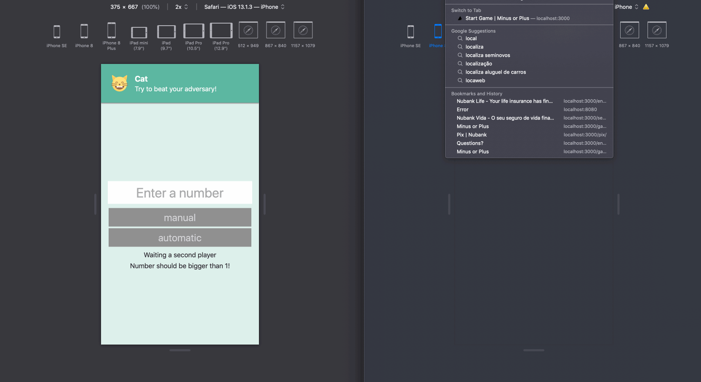
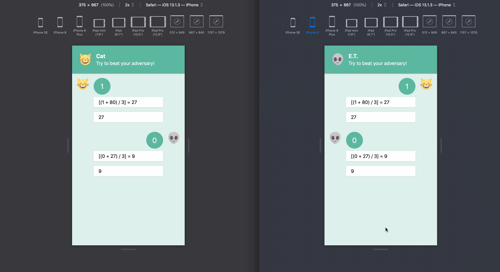
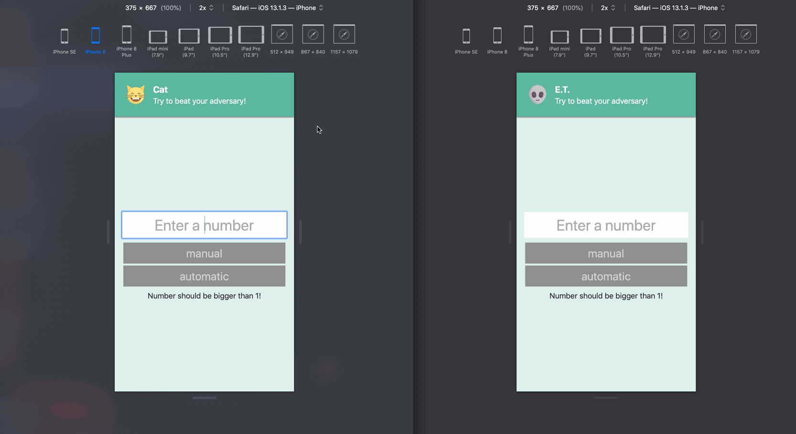
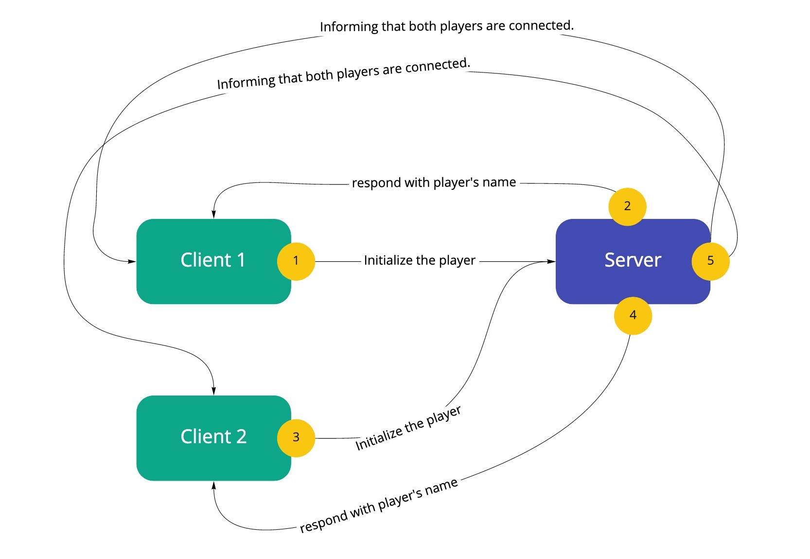

## Minus or Plus

This is a game to guess the correct addition to transforming a number into a new one divisible by 3.
  
### How to run the project

You will need to have `node >= 14` installed on your machine, use your preferred node version management such as `n` or `nvm`. Also, it is necessary to have a node package manager like `npm` or `yarn`, pick the one that you used to work.

After install everything on your environment, those ones are the commands that you need to know:

  
#### Client 
`localhost:3000`

`$ yarn dev` 
To run the application in development mode

`$ yarn build` 
Builds the application to production usage

`$ yarn start` 
Starts a production server

`$ yarn lint` 
To run the lint on the client application

`$ yarn test` 
To run all tests

`$ yarn test:watch` 
To run tests in watch mode 

   
#### Server 
`localhost:8080`

`yarn backend` 
To start the backend
  
### How to play 

There are two ways to play the game: against the computer or letting two machines competing automatically.
To play on your machine, start the server and client and open two tabs on your browser, you will need to have 2 players to start the game. 

Once that you have both players, chose the starting number and the game mode: manual or automatic.

Now you need to make your moves through the buttons with the possible values to add to the previous number. Both players will make their moves until one reaches the final result of 1 (and this is a winning).

If you chose to start the game with the automatic mode, you will watch the computer playing. In the end, it is possible to restart the game and select a new number and mode.

  
### The project
This project is organized into the backend and frontend. To create the frontend I have started using Next.Js because my first approach was to have different routes for each game screen. Using Next would be a good choice because I could use the routes abstraction and pass data through screens using server side properties and query strings. I had also the intent to test the API routing with web socket to not have two different projects.

Turns out that when I had finished the front and started to work on the server I could not have enough material about setting a web socket server + Next.JS. So I decided to change a bit my initial approach and transform the previous pages into containers with the screens and move my server to a different structure.

Along with Next.JS (that I have continued using besides the structure changes), I am using Styled Components to deal with styling, Jest, and React Testing Library to testing the frontend, and Socket.io to create my server.

#### Communication

The project uses real-time and event-based communication between clients and the server. To be able to have the game running in two different browsers I have chosen Socket.io, which is a library that is very suitable to project with this purpose.

In the example below, we can follow the exchange of events on the flow to connect both players and allow the application to start a new game.

### Improvements

Due to the timebox that I settled to myself, I will register here some improvements that I can point to be priorited in a future version of this project:
- Automatic scroll on the game screen to follow the moves
- Integration tests between components and client/server communication
- Improve the structure of the server project and isolate behaviors to test
- Remove Next.JS dependency, since it is not necessary anymore.
- Enable the user to choose his name and icon
- Animations on the while the "computer is deciding" his move, screen transitions and put some sugar on the UI.